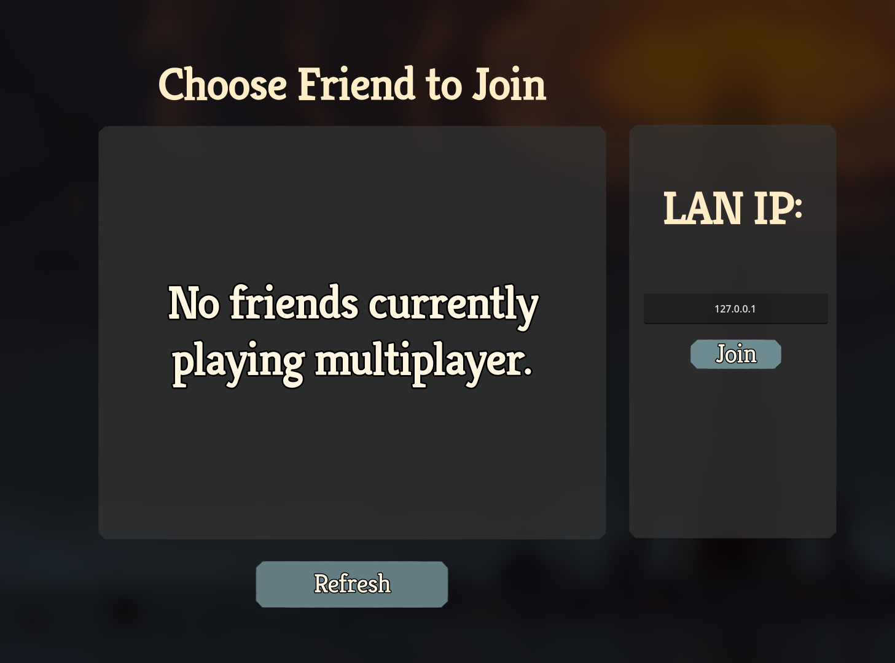
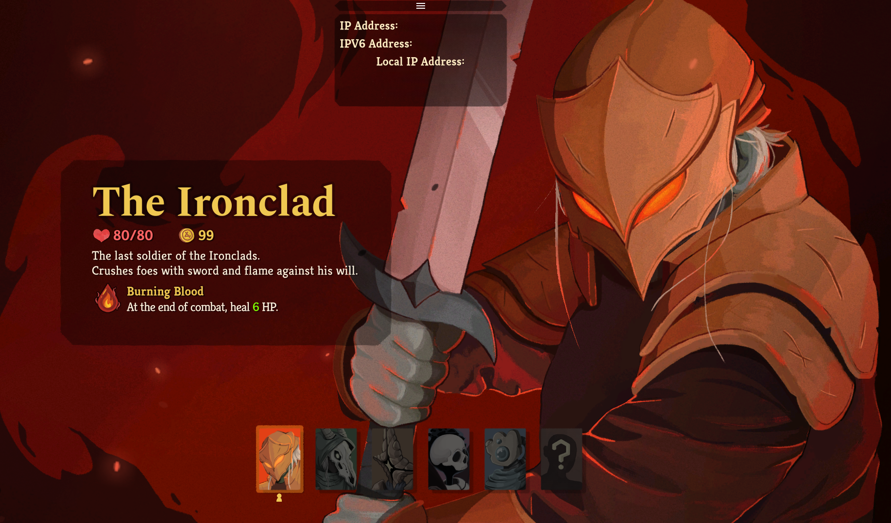
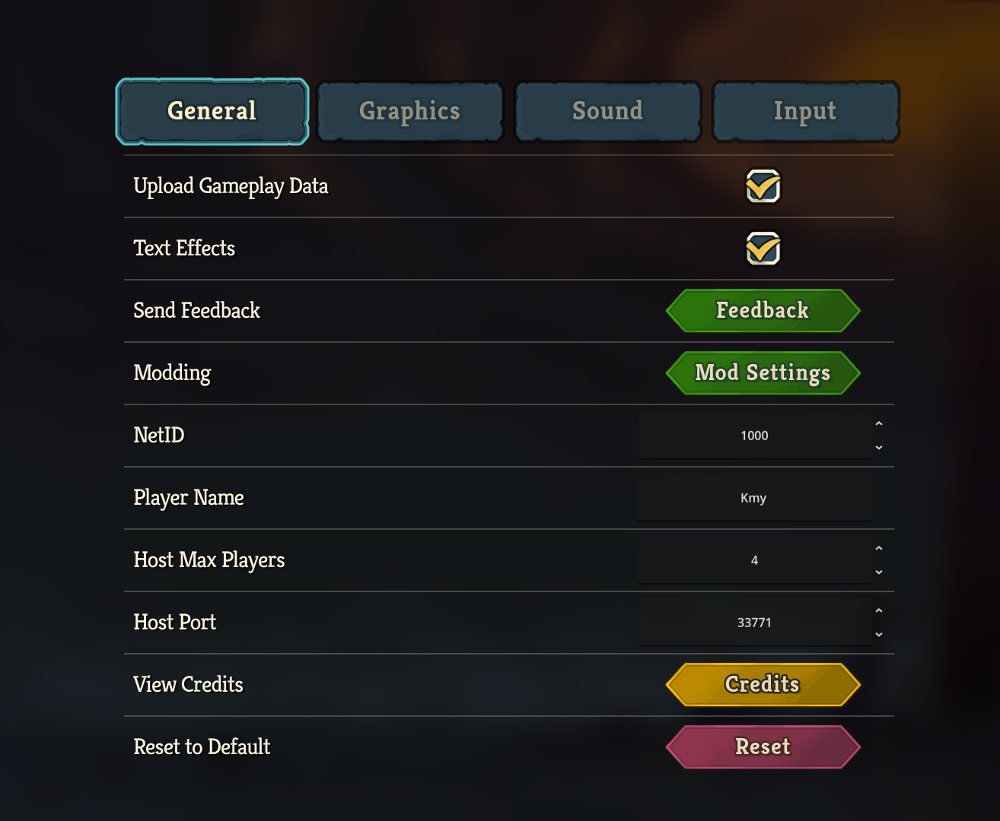

# SlayTheSpire2.LAN.Multiplayer


A mod for [Slay the Spire 2](https://store.steampowered.com/app/2868840/) that adds **LAN (Local Area Network) multiplayer**, allowing you to play with friends over a local network without requiring Steam multiplayer services.

## Features

- **LAN Host & Join** — Host or join multiplayer sessions over your local network
- **Multiple Game Modes** — Supports Standard, Daily, and Custom runs
- **Configurable Settings** — Custom host port, max players, and player name
- **Multi-language Support** — 14 languages: English, Simplified Chinese, Japanese, Korean, French, German, Spanish, Italian, Polish, Portuguese, Russian, Thai, Turkish, Latin American Spanish
- **Cross-platform** — Works on Windows, macOS, and Linux

## Installation

1. Download the latest release archive
2. Extract to get the `mods` folder
3. Place the `mods` folder into your Slay the Spire 2 game directory

The resulting directory structure should be:
```
<Slay the Spire 2>/
└── mods/
    └── SlayTheSpire2.LAN.Multiplayer/
        ├── SlayTheSpire2.LAN.Multiplayer.dll
        ├── mod_image.png
        └── mod_manifest.json
```

## Usage

1. Launch the game (it will show "RUNNING MODDED!" if installed correctly)
2. From the main menu, select **Multiplayer**
3. **Host**: Click "LAN Host" to start a LAN session (your IP will be shown to share with friends)
4. **Join**: Click "Join Friends" and enter the host's IP address to connect

## Build From Source

### Prerequisites

- .NET 9 SDK
- Installed Slay the Spire 2
- 7-Zip (`7zz` on macOS / `7z` on Windows/Linux) for `.7z` packaging (optional, falls back to `.zip`)

### macOS / Linux

```bash
# Default (auto-detects game installation)
./scripts/build-package.sh

# Custom game install path
STS2_INSTALL_DIR="$HOME/Library/Application Support/Steam/steamapps/common/Slay the Spire 2/SlayTheSpire2.app/Contents/Resources" \
./scripts/build-package.sh

# Direct data folder override
STS2_DATA_DIR="$HOME/Library/Application Support/Steam/steamapps/common/Slay the Spire 2/SlayTheSpire2.app/Contents/Resources/data_sts2_macos_arm64" \
./scripts/build-package.sh
```

### Windows

```powershell
# Default (auto-detects game installation)
dotnet build SlayTheSpire2.LAN.Multiplayer/SlayTheSpire2.LAN.Multiplayer.csproj -c Release

# Custom game path
dotnet build SlayTheSpire2.LAN.Multiplayer/SlayTheSpire2.LAN.Multiplayer.csproj -c Release /p:Sts2InstallDir="D:\SteamLibrary\steamapps\common\Slay the Spire 2"

# Direct data folder override
dotnet build SlayTheSpire2.LAN.Multiplayer/SlayTheSpire2.LAN.Multiplayer.csproj -c Release /p:Sts2DataDir="D:\SteamLibrary\steamapps\common\Slay the Spire 2\data_sts2_windows_x86_64"
```

### Build Output

- Package: `artifacts/SlayTheSpire2.LAN.Multiplayer.Release_<version>.7z` (or `.zip`)
- Extracted content: `artifacts/mods/SlayTheSpire2.LAN.Multiplayer/`

## Compatibility

- Game version: **0.103.2**
- Mod version: **1.6.3**
- Platforms: Windows (x86_64), macOS (ARM64 / x86_64), Linux (x86_64)

## Screenshot






